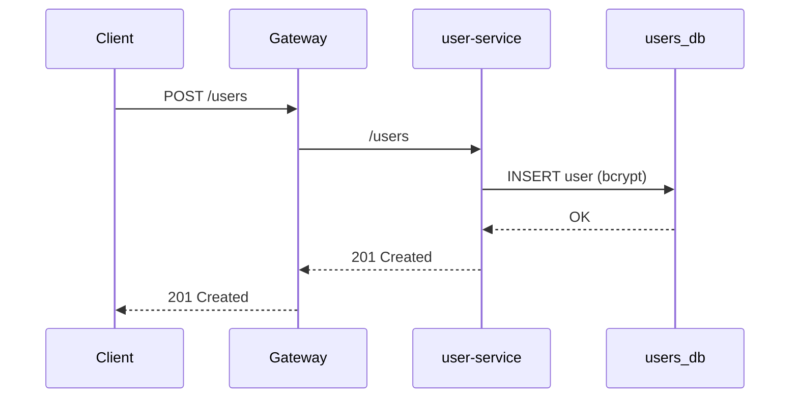
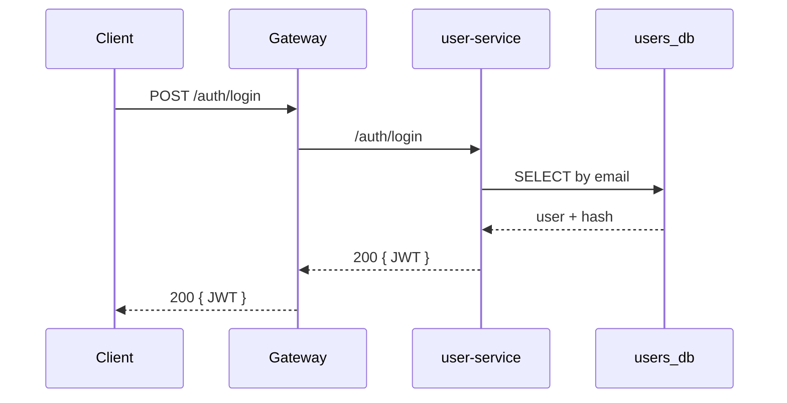
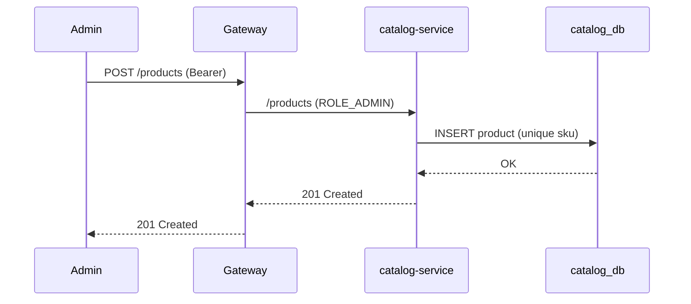
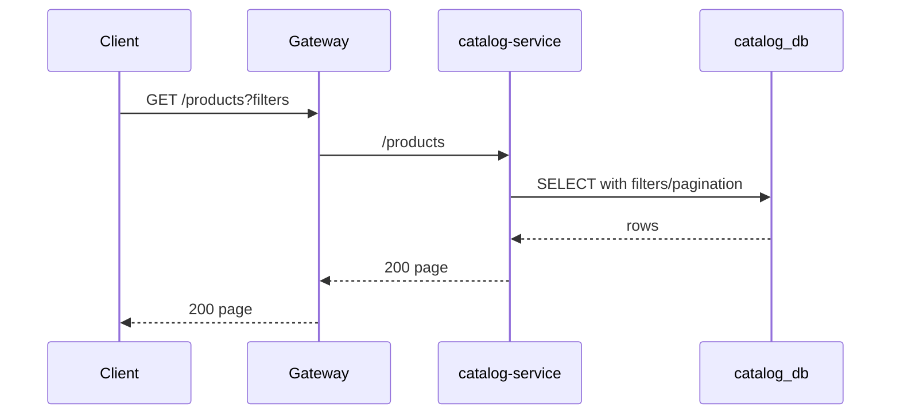

# Sequence Diagrams

**Date:** 2026-03-03

---

## Registration

```mermaid
sequenceDiagram
  participant Client
  participant Gateway
  participant UserSvc as user-service
  participant UsersDB as users_db

  Client->>Gateway: POST /users
  Gateway->>UserSvc: /users
  UserSvc->>UsersDB: INSERT user (bcrypt)
  UsersDB-->>UserSvc: OK
  UserSvc-->>Gateway: 201 Created
  Gateway-->>Client: 201 Created
```

## Login

```mermaid
sequenceDiagram
  participant Client
  participant Gateway
  participant UserSvc as user-service
  participant UsersDB as users_db

  Client->>Gateway: POST /auth/login
  Gateway->>UserSvc: /auth/login
  UserSvc->>UsersDB: SELECT by email
  UsersDB-->>UserSvc: user + hash
  UserSvc-->>Gateway: 200 { JWT }
  Gateway-->>Client: 200 { JWT }
```

## Create Product (ADMIN)

```mermaid
sequenceDiagram
  participant Admin
  participant Gateway
  participant CatalogSvc as catalog-service
  participant CatalogDB as catalog_db

  Admin->>Gateway: POST /products (Bearer)
  Gateway->>CatalogSvc: /products (ROLE_ADMIN)
  CatalogSvc->>CatalogDB: INSERT product (unique sku)
  CatalogDB-->>CatalogSvc: OK
  CatalogSvc-->>Gateway: 201 Created
  Gateway-->>Admin: 201 Created
```

## List/Search Products

```mermaid
sequenceDiagram
  participant Client
  participant Gateway
  participant CatalogSvc as catalog-service
  participant CatalogDB as catalog_db

  Client->>Gateway: GET /products?filters
  Gateway->>CatalogSvc: /products
  CatalogSvc->>CatalogDB: SELECT with filters/pagination
  CatalogDB-->>CatalogSvc: rows
  CatalogSvc-->>Gateway: 200 page
  Gateway-->>Client: 200 page
```
